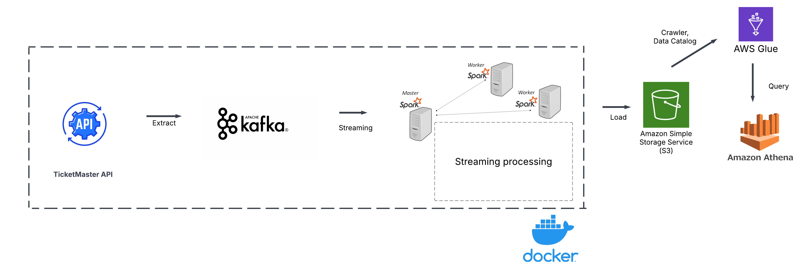

# Streaming Data TicketMaster

This repository contains a beginner project that aims to familiarize with distributed-system concept by Kafka Producer sending messages to multiple topics, Spark Structured Streaming, usage of AWS Cloud ecosystem . The goal is to collect streaming data, process it in real time, store it in an optimized data storage for further query performance.

## Data Workflow
1. Before streaming into Kafka, each upcoming event (music, sport, art&theater,...) extracted from TicketMaster API is split into data pieces, which are then sent in appropriate topics (event_data, sales_data, classification_data, venue_data, attraction_data)
2. Kafka publics messages to Spark (1 master node, 2 worker nodes) to continue transform data
3. After Spark's streaming process, partition parquet files from each topic are stored in AWS S3
4. Using AWS Glue to crawl data schema, transform parquet  into table format ; then performing queries in AWS Athena  

Kafka and Spark are deployed in Docker container

## Technology Stack
- Apache Kafka: An open-source distributed event store and stream-processing platform
- Apache Spark: An open-source unified analytics engine for large-scale data processing
- Docker:  An open platform for developing, shipping, and running applications
- AWS (S3, Glue, Athena) :  on-demand cloud computing platforms and APIs

## Project Structure
* jobs: contains file creating Kafka Producer for sending messages, submitting spark job processing data
* Data_Query: contains  result queried datasets 
